---
# You can also start simply with 'default'
theme: seriph
# random image from a curated Unsplash collection by Anthony
# like them? see https://unsplash.com/collections/94734566/slidev
background: https://image-assets.eu-2.volcanic.cloud/api/v1/assets/images/211f19435904e82bc0b5d9a45af97a02?webp_fallback=png
# some information about your slides (markdown enabled)
title: QuantRL
info: |
  ## Slidev Starter Template
  Presentation slides for developers.

  Learn more at [Sli.dev](https://sli.dev)
# apply unocss classes to the current slide
class: text-center
# https://sli.dev/features/drawing
drawings:
  persist: false
# slide transition: https://sli.dev/guide/animations.html#slide-transitions
transition: slide-left
hideInToc: true 
# enable MDC Syntax: https://sli.dev/features/mdc
mdc: true
# open graph
# seoMeta:
#  ogImage: https://cover.sli.dev
---

# QuantRL

<p class="subtitle">Algorithmic Trading Strategy Powered By Reinforcement Learning</p>

<div @click="$slidev.nav.next" class="mt-12 py-1" hover:bg="white op-10">
  Press Space for next page <carbon:arrow-right />
</div>

<style>
.subtitle {
  opacity: 0.9;
  font-weight: 500;
  font-size: 1.25rem;
}
</style>

<div class="abs-br m-6 text-xl">
  <button @click="$slidev.nav.openInEditor()" title="Open in Editor" class="slidev-icon-btn">
    <carbon:edit />
  </button>
  <a href="https://github.com/slidevjs/slidev" target="_blank" class="slidev-icon-btn">
    <carbon:logo-github />
  </a>
</div>

---
layout: default
hideInToc: true
transition: fade-in
---


# Table of contents

<Toc maxDepth="1"></Toc>

<style>
h1 {
  background-color: #2B90B6;
  background-image: linear-gradient(45deg, #4EC5D4 10%, #146b8c 20%);
  background-size: 100%;
  -webkit-background-clip: text;
  -moz-background-clip: text;
  -webkit-text-fill-color: transparent;
  -moz-text-fill-color: transparent;
}
</style>

---
transition: fade-out
---

# Motivation
<div class="text-gray-500 mb-4 text-lg">Existing RL projects applied to trading often fall short due to oversimplification and lack of robustness</div>
<div class="grid grid-cols-12 gap-0">

<div class="col-span-5 pr-4">

<h4 
  class="text-blue-600 mb-3 flex items-center text-lg"
  v-motion
  :initial="{ opacity: 0 }"
  :enter="{ opacity: 1, transition: { delay: 300, duration: 300 } }"
>
  <carbon-search class="mr-2" /> Observations:
</h4>

<div v-motion :initial="{ y: 50, opacity: 0 }" :enter="{ y: 0, opacity: 1, transition: { delay: 400, duration: 300 } }">
  <div class="mb-4">
    <div v-motion :initial="{ x: -50, opacity: 0 }" :enter="{ x: 0, opacity: 1, transition: { delay: 500, duration: 200 } }" class="flex items-center"><span class="mr-2">📝</span> Unrealistic market dynamics</div>
    <div v-motion :initial="{ x: -50, opacity: 0 }" :enter="{ x: 0, opacity: 1, transition: { delay: 600, duration: 200 } }" class="flex items-center"><span class="mr-2">🧩</span> Inadequate State Representation</div>
    <div v-motion :initial="{ x: -50, opacity: 0 }" :enter="{ x: 0, opacity: 1, transition: { delay: 700, duration: 200 } }" class="flex items-center"><span class="mr-2">💸</span> Ignoring Costs & Slippage</div>
    <div v-motion :initial="{ x: -50, opacity: 0 }" :enter="{ x: 0, opacity: 1, transition: { delay: 800, duration: 200 } }" class="flex items-center"><span class="mr-2">🤔</span> Poor Reward Shaping</div>
    <div v-motion :initial="{ x: -50, opacity: 0 }" :enter="{ x: 0, opacity: 1, transition: { delay: 900, duration: 200 } }" class="flex items-center"><span class="mr-2">🛒</span> Limited Action Space / Order Types</div>
  </div>
</div>

<div v-motion :initial="{ y: 50, opacity: 0 }" :enter="{ y: 0, opacity: 1, transition: { delay: 1100, duration: 300 } }">
  <h4 
      class="text-blue-600 mb-3 flex items-center text-lg"
      v-motion
      :initial="{ opacity: 0 }"
      :enter="{ opacity: 1, transition: { delay: 1100, duration: 300 } }"
    >
      <div class="i-carbon-catalog mr-2"></div> Some examples:
    </h4>

  <div class="space-y-3 text-sm">
    <div v-motion :initial="{ x: -50, opacity: 0 }" :enter="{ x: 0, opacity: 1, transition: { delay: 1200, duration: 200 } }">
      <a href="https://github.com/AminHP/gym-anytrading" target="_blank" class="inline-flex items-center px-3 py-1 rounded-full bg-gray-100 hover:bg-blue-100 transition-colors border border-gray-200 hover:border-blue-300">
        <carbon:logo-github class="mr-1 text-blue-600" /> <span class="font-medium">Gym-AnyTrading</span>
      </a>
    </div>
    <div v-motion :initial="{ x: -50, opacity: 0 }" :enter="{ x: 0, opacity: 1, transition: { delay: 1300, duration: 200 } }">
      <a href="https://github.com/AI4Finance-Foundation/FinRL" target="_blank" class="inline-flex items-center px-3 py-1 rounded-full bg-gray-100 hover:bg-blue-100 transition-colors border border-gray-200 hover:border-blue-300">
        <carbon:logo-github class="mr-1 text-blue-600" /> <span class="font-medium">FinRL</span>
      </a>
    </div>
    <div v-motion :initial="{ x: -50, opacity: 0 }" :enter="{ x: 0, opacity: 1, transition: { delay: 1400, duration: 200 } }">
      <a href="https://github.com/ClementPerroud/Gym-Trading-Env" target="_blank" class="inline-flex items-center px-3 py-1 rounded-full bg-gray-100 hover:bg-blue-100 transition-colors border border-gray-200 hover:border-blue-300">
        <carbon:logo-github class="mr-1 text-blue-600" /> <span class="font-medium">Gym-Trading-Env</span>
      </a>
    </div>
  </div>
</div>

</div>

<div class="col-span-7 pl-4" v-motion :initial="{ x: 100, opacity: 0 }" :enter="{ x: 0, opacity: 1, transition: { delay: 400, duration: 400 } }">
  <h4 
    class="text-blue-600 mb-3 flex items-center text-lg"
    v-motion
    :initial="{ opacity: 0 }"
    :enter="{ opacity: 1, transition: { delay: 500, duration: 300 } }"
  >
    <div class="i-carbon-warning-alt mr-2"></div> Skepticism:
  </h4>
  <div class="flex flex-col space-y-6">
    <div class="relative">
      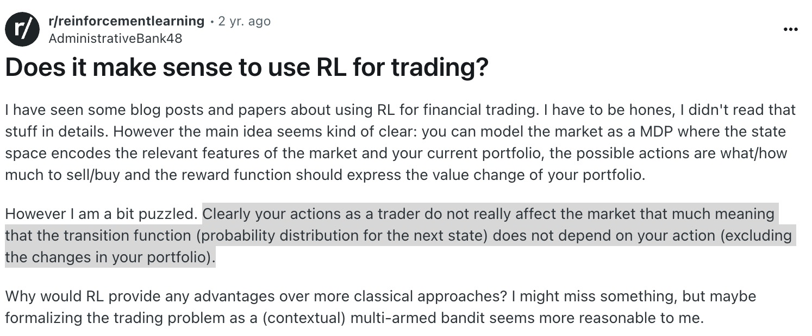
    </div>
    <div class="relative">
      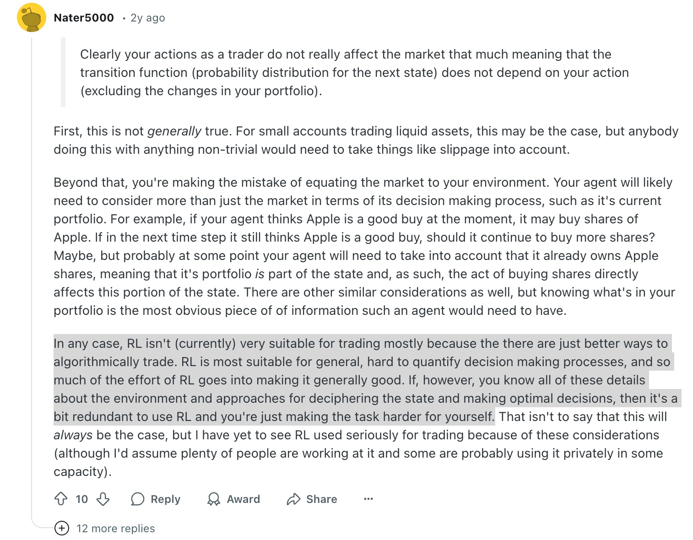
    </div>
  </div>
</div>
</div>

<style>
h1 {
  background-color: #2B90B6;
  background-image: linear-gradient(45deg, #4EC5D4 10%, #146b8c 20%);
  background-size: 100%;
  -webkit-background-clip: text;
  -moz-background-clip: text;
  -webkit-text-fill-color: transparent;
  -moz-text-fill-color: transparent;
}
</style>

---
transition: fade-out
---


# Gaps in Market Realism (Examples)

<div class="col-span-8" v-motion :initial="{ x: -50, opacity: 0 }" :enter="{ x: 0, opacity: 1, transition: { duration: 500 } }">

```python {4-7} {scale: 0.9}
for index in np.where(actions < -min_action)[0]:  # sell_index:
    if price[index] > 0:  # Sell only if current asset is > 0
        sell_num_shares = min(self.stocks[index], -actions[index])
        self.stocks[index] -= sell_num_shares
        self.cash += (
            price[index] * sell_num_shares * (1 - self.sell_cost_pct)
        )
        self.stocks_cool_down[index] = 0
```
<div class="text-sm text-gray-500 mt-2">
  Simplistic transaction model: Only market orders
</div>

```python
# ... calculate new total_asset based on current prices and holdings ...
reward = (total_asset - self.total_asset) * self.reward_scaling
# ... update self.total_asset for the next step ...

# ... accumulate discounted reward ...
self.gamma_reward = self.gamma_reward * self.gamma + reward

# ... at the very end of the episode ...
if done:
    reward = self.gamma_reward # Final step's reward is replaced
    self.episode_return = total_asset / self.initial_total_asset
```
<div class="text-sm text-gray-500 mt-2">
  Does not account for anything else other than the Portfolio Value
</div>


</div>

<style>
h1 {
  background-color: #2B90B6;
  background-image: linear-gradient(45deg, #4EC5D4 10%, #146b8c 20%);
  background-size: 100%;
  -webkit-background-clip: text;
  -moz-background-clip: text;
  -webkit-text-fill-color: transparent;
  -moz-text-fill-color: transparent;
}
</style>

---
transition: slide-up
---

# Scope and Deliverables
What we are trying to test and validate

<div class="grid grid-cols-2 gap-8">
<div v-motion :initial="{ x: -100, opacity: 0 }" :enter="{ x: 0, opacity: 1, transition: { duration: 800 } }" class="bg-white bg-opacity-90 p-6 rounded-lg shadow-md border-l-4 border-green-500">

## Hypothesis
<div class="text-gray-600 mb-6 text-lg font-light">RL based trading can be more promising given:</div>


<div class="space-y-4">
  <div class="flex items-start">
    <div class="text-green-500 text-xl mr-3">✓</div>
    <div>Better designed market environments</div>
  </div>
  <div class="flex items-start">
    <div class="text-green-500 text-xl mr-3">✓</div>
    <div>Realistic action spaces</div>
  </div>
  <div class="flex items-start">
    <div class="text-green-500 text-xl mr-3">✓</div>
    <div>Proper reward shaping mechanisms</div>
  </div>
</div>
</div>

<div v-motion :initial="{ x: 100, opacity: 0 }" :enter="{ x: 0, opacity: 1, transition: { duration: 800, delay: 300 } }" class="bg-white bg-opacity-90 p-6 rounded-lg shadow-md border-l-4 border-blue-500">

## Project Deliverables
<div class="space-y-4 mt-4">
  <div class="flex items-start">
    <div v-motion :initial="{ scale: 0, opacity: 0 }" :enter="{ scale: 1, opacity: 1, transition: { delay: 800, duration: 300 } }" class="flex-shrink-0 h-10 w-10 flex items-center justify-center rounded-full bg-blue-100 text-blue-600 mr-3">
      <div class="i-carbon-finance text-xl"></div>
    </div>
    <div class="pt-1">Enhanced trading environment with realistic market dynamics</div>
  </div>
  <div class="flex items-start">
    <div v-motion :initial="{ scale: 0, opacity: 0 }" :enter="{ scale: 1, opacity: 1, transition: { delay: 1000, duration: 300 } }" class="flex-shrink-0 h-10 w-10 flex items-center justify-center rounded-full bg-blue-100 text-blue-600 mr-3">
      <div class="i-carbon-chart-line-data text-xl"></div>
    </div>
    <div class="pt-1">Performance benchmarks against traditional methods</div>
  </div>
  <div class="flex items-start">
    <div v-motion :initial="{ scale: 0, opacity: 0 }" :enter="{ scale: 1, opacity: 1, transition: { delay: 1200, duration: 300 } }" class="flex-shrink-0 h-10 w-10 flex items-center justify-center rounded-full bg-blue-100 text-blue-600 mr-3">
      <div class="i-carbon-analytics text-xl"></div>
    </div>
    <div class="pt-1">Analysis of how environment design affects performance</div>
  </div>
</div>
</div>
</div>


<style>
h1 {
  background-color: #2B90B6;
  background-image: linear-gradient(45deg, #4EC5D4 10%, #146b8c 20%);
  background-size: 100%;
  -webkit-background-clip: text;
  -moz-background-clip: text;
  -webkit-text-fill-color: transparent;
  -moz-text-fill-color: transparent;
}
</style>

---
transition: slide-down
---

# Auxiliary Data to Augment the Environment
Additional data sources considered to enhance the states and observations

<div class="grid grid-cols-2 gap-x-8 gap-y-6 mt-4">
  <div v-motion :initial="{ y: 50, opacity: 0 }" :enter="{ y: 0, opacity: 1, transition: { delay: 300 } }">
    <div class="flex items-center mb-2">
      <div class="h-8 w-8 rounded-full bg-blue-100 flex items-center justify-center mr-2 text-lg">
        📊
      </div>
      <h3 class="text-lg font-semibold text-blue-600">Technical Indicators</h3>
    </div>
    <ul class="ml-10 space-y-1 text-sm text-gray-700">
      <li class="flex items-center">
        <div class="text-blue-500 mr-2 text-xs">▶</div>
        Moving averages (SMA, EMA, VWAP)
      </li>
      <li class="flex items-center">
        <div class="text-blue-500 mr-2 text-xs">▶</div>
        Oscillators (RSI, MACD, Stochastic)
      </li>
      <li class="flex items-center">
        <div class="text-blue-500 mr-2 text-xs">▶</div>
        Volatility indicators (Bollinger Bands, ATR)
      </li>
    </ul>
  </div>

  <div v-motion :initial="{ y: 50, opacity: 0 }" :enter="{ y: 0, opacity: 1, transition: { delay: 450 } }">
    <div class="flex items-center mb-2">
      <div class="h-8 w-8 rounded-full bg-green-100 flex items-center justify-center mr-2 text-lg">
        💹
      </div>
      <h3 class="text-lg font-semibold text-green-600">Fundamental Data (YFinance)</h3>
    </div>
    <ul class="ml-10 space-y-1 text-sm text-gray-700">
      <li class="flex items-center">
        <div class="text-green-500 mr-2 text-xs">▶</div>
        Financial statements (income, balance sheets)
      </li>
      <li class="flex items-center">
        <div class="text-green-500 mr-2 text-xs">▶</div>
        Key Profitability Ratio (ROA, ROE)
      </li>
    </ul>
  </div>

  <div v-motion :initial="{ y: 50, opacity: 0 }" :enter="{ y: 0, opacity: 1, transition: { delay: 600 } }">
    <div class="flex items-center mb-2">
      <div class="h-8 w-8 rounded-full bg-amber-100 flex items-center justify-center mr-2 text-lg">
        🌐
      </div>
      <h3 class="text-lg font-semibold text-amber-600">Macro & Sector Data (FMP)</h3>
    </div>
    <ul class="ml-10 space-y-1 text-sm text-gray-700">
      <li class="flex items-center">
        <div class="text-amber-500 mr-2 text-xs">▶</div>
        Sector performance
      </li>
      <li class="flex items-center">
        <div class="text-amber-500 mr-2 text-xs">▶</div>
        Economic indicators (GDP, CPI, Non-farm payroll)
      </li>
      <li class="flex items-center">
        <div class="text-amber-500 mr-2 text-xs">▶</div>
        Analyst ratings & price targets
      </li>
    </ul>
  </div>

  <div v-motion :initial="{ y: 50, opacity: 0 }" :enter="{ y: 0, opacity: 1, transition: { delay: 750 } }">
    <div class="flex items-center mb-2">
      <div class="h-8 w-8 rounded-full bg-purple-100 flex items-center justify-center mr-2 text-lg">
        📰
      </div>
      <h3 class="text-lg font-semibold text-purple-600">News & Events (Alpaca/FMP)</h3>
    </div>
    <ul class="ml-10 space-y-1 text-sm text-gray-700">
      <li class="flex items-center">
        <div class="text-purple-500 mr-2 text-xs">▶</div>
        Sentiment analysis from stock news
      </li>
      <li class="flex items-center">
        <div class="text-purple-500 mr-2 text-xs">▶</div>
        Calendar events (e.g., Fed announcement)
      </li>
    </ul>
  </div>
</div>

<style>
h1 {
  background-color: #2B90B6;
  background-image: linear-gradient(45deg, #4EC5D4 10%, #146b8c 20%);
  background-size: 100%;
  -webkit-background-clip: text;
  -moz-background-clip: text;
  -webkit-text-fill-color: transparent;
  -moz-text-fill-color: transparent;
}
</style>

---
layout: center
class: text-center
background: "/imgs/meme-stock-trading_300932-16025.avif"
---

# Single Stock Example

<div class="mt-10 text-sm opacity-70">
  <div class="flex justify-center items-center">
    <carbon:information class="mr-2" />
    <span>MU on different frequencies</span>
  </div>
</div>

<style>
h1 {
  background-color: #2B90B6;
  background-image: linear-gradient(45deg, #4EC5D4 10%, #146b8c 20%);
  background-size: 100%;
  -webkit-background-clip: text;
  -moz-background-clip: text;
  -webkit-text-fill-color: transparent;
  -moz-text-fill-color: transparent;
}
</style>

---
transition: fade-in
---
# Designing the Custom Trading Environment

<div class="grid grid-cols-12 gap-8">
  <div class="col-span-6" v-motion :initial="{ x: -50, opacity: 0 }" :enter="{ x: 0, opacity: 1, transition: { duration: 500 } }">
    <h4 class="text-lg font-medium text-blue-600 mb-4">Action Space Definition</h4>

```python {all|2-4|5-6|7-8} {scale: 0.9}
class Actions(IntEnum):
    Hold = 0
    Buy = 1      # Market Buy
    Sell = 2     # Market Sell
    LimitBuy = 3  # Limit Order Buy
    LimitSell = 4 # Limit Order Sell
    StopLoss = 5  # Stop loss order
    TakeProfit = 6 # Take Profit order
```
```python
self.action_space = spaces.Box(
            low=np.array([action_type_low, amount_low, price_mod_low], dtype=np.float32),
            high=np.array([action_type_high, amount_high, price_mod_high], dtype=np.float32),
            shape=(3,),
            dtype=np.float32
        )
```
   <div class="text-sm text-gray-500 mt-2">
      Enhanced action space supporting multiple order types
    </div>
    <div class="text-sm text-gray-500 mt-2">
      Assumes a time in force to be GTC (5 days)
    </div>
    <div class="text-sm text-gray-500 mt-2">
      Trade offs between compatibility and semantic meaning
    </div>
  </div>

  <div class="col-span-6" v-motion :initial="{ x: 50, opacity: 0 }" :enter="{ x: 0, opacity: 1, transition: { delay: 300, duration: 500 } }">
    <h4 class="text-lg font-medium text-blue-600 mb-4">Mapping to Alpaca API</h4>
    <div class="space-y-4">
      <div class="flex items-start p-3 bg-blue-50 rounded-lg border-l-4 border-blue-500">
        <div class="flex-shrink-0 h-8 w-8 flex items-center justify-center rounded-full bg-blue-100 mr-3">
          🛒
        </div>
        <div>
          <div class="font-medium">Market Orders</div>
          <div class="text-sm text-gray-600">
            Buy (1) and Sell (2) map to market orders for immediate execution
          </div>
        </div>
      </div>
      <div class="flex items-start p-3 bg-green-50 rounded-lg border-l-4 border-green-500">
        <div class="flex-shrink-0 h-8 w-8 flex items-center justify-center rounded-full bg-green-100 mr-3">
          💰
        </div>
        <div>
          <div class="font-medium">Limit Orders</div>
          <div class="text-sm text-gray-600">
            LimitBuy (3) and LimitSell (4) map to limit orders at specified prices
          </div>
        </div>
      </div>
      <div class="flex items-start p-3 bg-amber-50 rounded-lg border-l-4 border-amber-500">
        <div class="flex-shrink-0 h-8 w-8 flex items-center justify-center rounded-full bg-amber-100 mr-3">
          ⚠️
        </div>
        <div>
          <div class="font-medium">Stop Orders</div>
          <div class="text-sm text-gray-600">
            StopLoss (5) and TakeProfit (6) map to stop orders for risk management
          </div>
        </div>
      </div>
    </div>
  </div>
</div>

<style>
h1 {
  background-color: #2B90B6;
  background-image: linear-gradient(45deg, #4EC5D4 10%, #146b8c 20%);
  background-size: 100%;
  -webkit-background-clip: text;
  -moz-background-clip: text;
  -webkit-text-fill-color: transparent;
  -moz-text-fill-color: transparent;
}
</style>

---
transition: fade-in
hideInToc: true 
---
# Designing the Custom Trading Environment (2)


<div class="text-gray-500 text-sm mb-4">Observable States Design</div>

<div class="grid grid-cols-2 gap-x-8 mt-4">
  <div v-motion :initial="{ x: -50, opacity: 0 }" :enter="{ x: 0, opacity: 1, transition: { duration: 500 } }">
    <div class="p-4 bg-blue-50 rounded-lg border-l-4 border-blue-500">
      <h3 class="text-base font-semibold text-blue-600 mb-3 flex items-center">
        <div class="h-6 w-6 rounded-full bg-blue-100 flex items-center justify-center mr-2">📈</div>
        Market Data Window
      </h3>
      <ul class="space-y-2 text-xs text-gray-700">
        <li class="flex items-start">
          <div class="text-blue-500 mr-2">▶</div>
          <div>Flattened array of last <code class="bg-blue-100 px-1 rounded">window_size</code> timesteps</div>
        </li>
        <li class="flex items-start">
          <div class="text-blue-500 mr-2">▶</div>
          <div>Includes OHLCV and other useful indicators</div>
        </li>
        <li class="flex items-start">
          <div class="text-blue-500 mr-2">▶</div>
          <div>Window-relative normalization for price scale invariance</div>
        </li>
      </ul>
    </div>
  </div>

  <div v-motion :initial="{ x: 50, opacity: 0 }" :enter="{ x: 0, opacity: 1, transition: { duration: 500, delay: 200 } }">
    <div class="p-4 bg-green-50 rounded-lg border-l-4 border-green-500">
      <h3 class="text-base font-semibold text-green-600 mb-3 flex items-center">
        <div class="h-6 w-6 rounded-full bg-green-100 flex items-center justify-center mr-2">📊</div>
        Portfolio Metrics
      </h3>
      <ul class="space-y-2 text-xs text-gray-700">
        <li class="flex items-start">
          <div class="text-green-500 mr-2">▶</div>
          <div>Normalized balance and position ratios</div>
        </li>
        <li class="flex items-start">
          <div class="text-green-500 mr-2">▶</div>
          <div>Unrealized P/L and price positioning</div>
        </li>
        <li class="flex items-start">
          <div class="text-green-500 mr-2">▶</div>
          <div>Volatility and trend strength indicators</div>
        </li>
        <li class="flex items-start">
          <div class="text-green-500 mr-2">▶</div>
          <div>Risk/Reward metrics from active orders</div>
        </li>
        <li class="flex items-start">
          <div class="text-green-500 mr-2">▶</div>
          <div>Distance to stop-loss and take-profit levels</div>
        </li>
      </ul>
    </div>
  </div>
</div>

<div class="mt-6 p-3 bg-gray-50 rounded-lg border border-gray-200" v-motion :initial="{ y: 50, opacity: 0 }" :enter="{ y: 0, opacity: 1, transition: { duration: 500, delay: 400 } }">
  <h4 class="text-sm font-medium text-gray-700 mb-2">📝 Implementation Notes:</h4>
  <ul class="space-y-1 text-xs text-gray-600 ml-4 list-disc">
    <li>All numerical features are normalized to prevent scaling issues</li>
    <li>Window-based normalization helps maintain local context</li>
    <li>Portfolio metrics provide a comprehensive view of trading status</li>
  </ul>
</div>

<style>
h1 {
  background-color: #2B90B6;
  background-image: linear-gradient(45deg, #4EC5D4 10%, #146b8c 20%);
  background-size: 100%;
  -webkit-background-clip: text;
  -moz-background-clip: text;
  -webkit-text-fill-color: transparent;
  -moz-text-fill-color: transparent;
}

code {
  font-family: 'Fira Code', monospace;
}
</style>

---
transition: fade-in
hideInToc: true 
---
# Designing the Custom Trading Environment (3)

<div class="text-gray-500 text-sm mb-4">Action Rewards Design</div>

<div class="grid grid-cols-2 gap-x-6 mt-4">
  <div v-motion :initial="{ x: -50, opacity: 0 }" :enter="{ x: 0, opacity: 1, transition: { duration: 500 } }">
    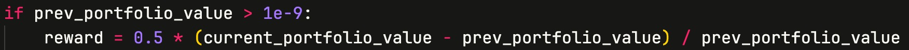
    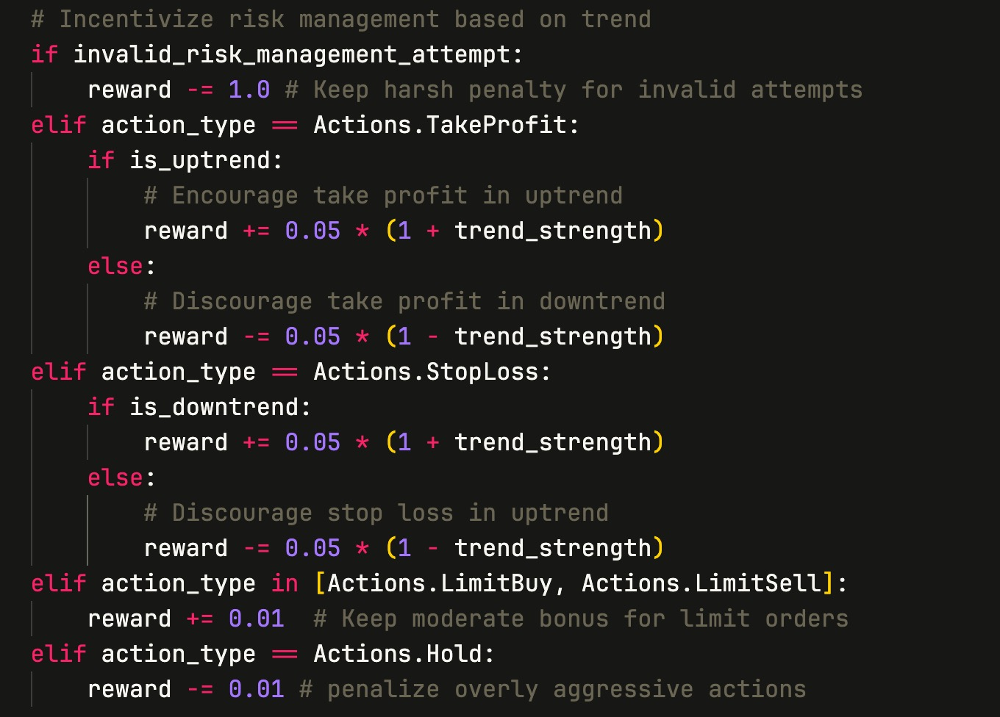
    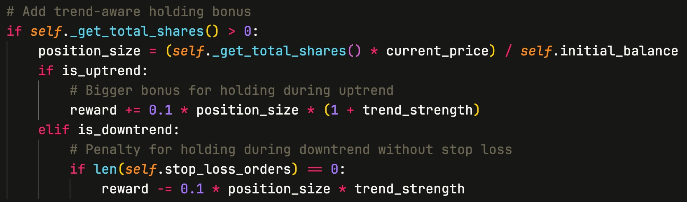
  </div>

  <div v-motion :initial="{ x: 50, opacity: 0 }" :enter="{ x: 0, opacity: 1, transition: { duration: 500 } }">
    <div class="space-y-3">
      <div class="p-3 bg-green-50 rounded-lg border-l-4 border-green-500">
        <h3 class="text-sm font-semibold text-green-600 mb-2 flex items-center">
          <div class="h-5 w-5 rounded-full bg-green-100 flex items-center justify-center mr-2">⚖️</div>
          Rewards
        </h3>
        <ul class="space-y-1 text-xs text-gray-600">
          <li class="flex items-start">
            <span class="text-green-500 mr-2">▶</span>
            <span>TP: +0.5 (portfolio change)</span>
          </li>
          <li class="flex items-start">
            <span class="text-green-500 mr-2">▶</span>
            <span>TP: +0.5 (uptrend) / -0.3 (downtrend)</span>
          </li>
          <li class="flex items-start">
            <span class="text-green-500 mr-2">▶</span>
            <span>SL: +0.5 (downtrend) / -0.3 (uptrend)</span>
          </li>
          <li class="flex items-start">
            <span class="text-green-500 mr-2">▶</span>
            <span>Limit: +0.2 flat bonus</span>
          </li>
        </ul>
      </div>
      <div class="p-3 bg-red-50 rounded-lg border-l-4 border-red-500">
        <h3 class="text-sm font-semibold text-red-600 mb-2 flex items-center">
          <div class="h-5 w-5 rounded-full bg-red-100 flex items-center justify-center mr-2">⚡</div>
          Penalties
        </h3>
        <ul class="space-y-1 text-xs text-gray-600">
          <li class="flex items-start">
            <span class="text-red-500 mr-2">▶</span>
            <span>Invalid actions: -1.0</span>
          </li>
          <li class="flex items-start">
            <span class="text-red-500 mr-2">▶</span>
            <span>No-trend hold: -0.1</span>
          </li>
          <li class="flex items-start">
            <span class="text-red-500 mr-2">▶</span>
            <span>Counter-trend: -0.2</span>
          </li>
        </ul>
      </div>
    </div>
  </div>
</div>

<style>
h1 {
  background-color: #2B90B6;
  background-image: linear-gradient(45deg, #4EC5D4 10%, #146b8c 20%);
  background-size: 100%;
  -webkit-background-clip: text;
  -moz-background-clip: text;
  -webkit-text-fill-color: transparent;
  -moz-text-fill-color: transparent;
}
</style>


---
transition: slide-down
---

# Single Stock Results Analysis
Daily frequency with auxiliary data

<div class="px-10 mt-6">
  <div v-motion :initial="{ y: 50, opacity: 0 }" :enter="{ y: 0, opacity: 1, transition: { duration: 500 } }">
    <div class="grid grid-cols-2 gap-6">
      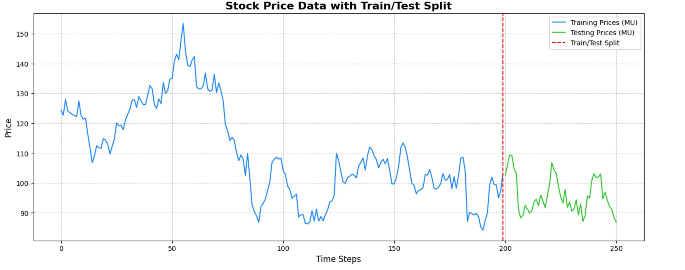
      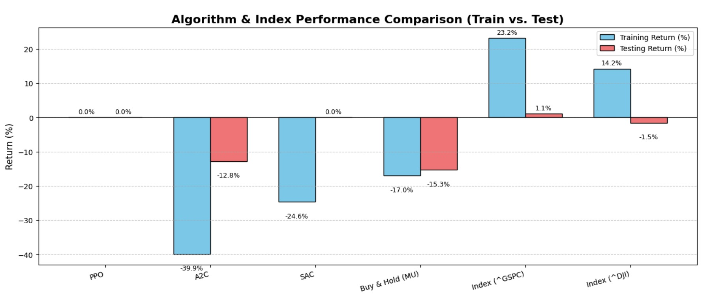
      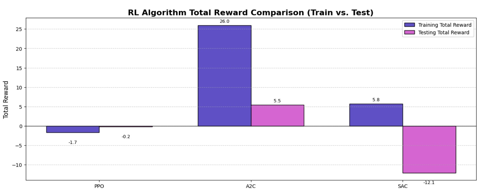
      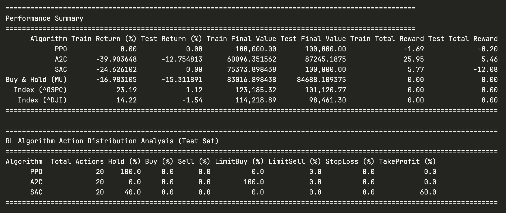
    </div>
  </div>
</div>

<style>
h1 {
  background-color: #2B90B6;
  background-image: linear-gradient(45deg, #4EC5D4 10%, #146b8c 20%);
  background-size: 100%;
  -webkit-background-clip: text;
  -moz-background-clip: text;
  -webkit-text-fill-color: transparent;
  -moz-text-fill-color: transparent;
}
</style>

---
layout: center
class: text-center
transition: slide-down
---

# Multi Stock Example

<div class="mt-10 text-sm opacity-70">
  <div class="flex justify-center items-center">
    <carbon:information class="mr-2" />
    <span>Beating the Index</span>
  </div>
</div>

<style>
h1 {
  background-color: #2B90B6;
  background-image: linear-gradient(45deg, #4EC5D4 10%, #146b8c 20%);
  background-size: 100%;
  -webkit-background-clip: text;
  -moz-background-clip: text;
  -webkit-text-fill-color: transparent;
  -moz-text-fill-color: transparent;
}
</style>
---
transition: slide-down
---

# Designing the Custom Trading Environment

<div class="mt-4 grid grid-cols-2 gap-4 max-w-3xl">

  <!-- Box 1: Base Observations -->
  <div v-motion :initial="{ x: -30, opacity: 0 }" :enter="{ x: 0, opacity: 1, transition: { duration: 400 } }">
    <div class="w-full h-full p-3 bg-purple-50 rounded-md border-l-4 border-purple-500">
      <h3 class="text-sm font-semibold text-purple-600 mb-2 flex items-center">
        <div class="h-5 w-5 rounded-full bg-purple-100 flex items-center justify-center mr-2 text-xs">🧠</div>
        Base Observations
      </h3>
      <ul class="space-y-1 text-[11px] text-gray-700">
        <li class="flex items-start">
          <div class="text-purple-500 mr-1">▶</div>
          <div>Cash Balance: Total amount of cash available</div>
        </li>
        <li class="flex items-start">
          <div class="text-purple-500 mr-1">▶</div>
          <div>Stock Info: Shares held & share price</div>
        </li>
        <li class="flex items-start">
          <div class="text-purple-500 mr-1">▶</div>
          <div>Indicators: Technical, macro, sector, events</div>
        </li>
      </ul>
    </div>
  </div>

  <!-- Box 2: Feature Engineering -->
  <div v-motion :initial="{ x: 30, opacity: 0 }" :enter="{ x: 0, opacity: 1, transition: { duration: 400, delay: 100 } }">
    <div class="w-full h-full p-3 bg-indigo-50 rounded-md border-l-4 border-indigo-500">
      <h3 class="text-sm font-semibold text-indigo-600 mb-2 flex items-center">
        <div class="h-5 w-5 rounded-full bg-indigo-100 flex items-center justify-center mr-2 text-xs">🔬</div>
        Feature Engineering
      </h3>
      <ul class="space-y-1 text-[11px] text-gray-700">
        <li class="flex items-start">
          <div class="text-indigo-500 mr-1">▶</div>
          <div>Rolling windows for momentum & volatility</div>
        </li>
        <li class="flex items-start">
          <div class="text-indigo-500 mr-1">▶</div>
          <div>Time-series indicators like SMA, RSI, MACD</div>
        </li>
        <li class="flex items-start">
          <div class="text-indigo-500 mr-1">▶</div>
          <div>News event sentiment summary</div>
        </li>
      </ul>
    </div>
  </div>

</div>

<!-- Side-by-Side Images -->
<div class="mt-6 p-3 bg-gray-50 rounded-lg border border-gray-200" v-motion :initial="{ y: 50, opacity: 0 }" :enter="{ y: 0, opacity: 1, transition: { duration: 500, delay: 400 } }">
  <h4 class="text-sm font-medium text-gray-700 mb-2">📝 Dataset Information:</h4>
  <ul class="space-y-1 text-xs text-gray-600 ml-4 list-disc">
    Dow Jones Industrial Average 30 stocks
    <li>Period: 2020-10 to 2025-03</li>
    <li>Mix of bullish and bearish market conditions over the period</li>
    <li>Useful proxy for general market sentiment</li>
  </ul>
</div>


<style>
h1 {
  background-color: #2B90B6;
  background-image: linear-gradient(45deg, #4EC5D4 10%, #146b8c 20%);
  background-size: 100%;
  -webkit-background-clip: text;
  -moz-background-clip: text;
  -webkit-text-fill-color: transparent;
  -moz-text-fill-color: transparent;
}
</style>

---
transition: fade-in
hideInToc: true 
---
# Designing the Custom Trading Environment (2)

<div class="text-gray-500 text-sm mb-4">Action Rewards Design</div>

<div class="text-gray-200 text-sm leading-relaxed">

  <h2 class="text-base font-semibold mt-4 mb-2">📈 Annualized Sharpe Ratio</h2>
  <div class="bg-gray-800 text-white text-sm font-mono p-3 rounded-lg">
    Sharpe<sub>annual</sub> = √N × (μ - r<sub>f</sub>) / σ
  </div>
  <ul class="mt-2 ml-4 list-disc text-xs">
    <li>μ = average return</li>
    <li>r<sub>f</sub> = risk-free rate</li>
    <li>σ = standard deviation of returns</li>
    <li>N = number of periods per year (e.g., 252 for daily)</li>
  </ul>

  <h1 class="text-lg font-bold mt-6 mb-2">🧮 Naive Asset Difference</h1>
  <div class="bg-gray-800 text-white text-sm font-mono p-3 rounded-lg">
    Signal<sub>t</sub> = Asset<sub>t</sub> - Asset<sub>t-1</sub>
  </div>
  <ul class="mt-2 ml-4 list-disc text-xs">
    <li>If Signal &gt; 0 → upward trend (buy bias)</li>
    <li>If Signal &lt; 0 → downward trend (sell bias)</li>
  </ul>

</div>

<style>
h1 {
  background-color: #2B90B6;
  background-image: linear-gradient(45deg, #4EC5D4 10%, #146b8c 20%);
  background-size: 100%;
  -webkit-background-clip: text;
  -moz-background-clip: text;
  -webkit-text-fill-color: transparent;
  -moz-text-fill-color: transparent;
}
</style>

---
transition: slide-down
hideInToc: true 
---
# Designing the Custom Trading Environment (3)

<div class="text-gray-500 text-sm mb-4">Action Space Definition</div>
<div class="grid grid-cols-3 gap-6 mt-10">

  <!-- Base Environment -->
  <div class="relative rounded-2xl p-3 shadow-lg border border-[#2B90B6]/30 bg-white/5 backdrop-blur-md hover:scale-[1.02] transition duration-200">
    <div class="absolute top-2 right-3 text-red-400 text-lg font-bold">×</div>
    <h2 class="text-base font-semibold mb-2 bg-gradient-to-r from-[#4EC5D4] via-[#2B90B6] to-[#146b8c] bg-clip-text text-transparent whitespace-pre-line leading-snug text-center">Base Env</h2>
    <ul class="text-sm leading-relaxed text-white/80">
      <li>One action type for all stocks</li>
      <li>Performs better with lower H value - Scaling Factor</li>
      <li>Rewards vary between 0 < r < 9% </li>
    </ul>
    <!-- Plot Image 1 -->
    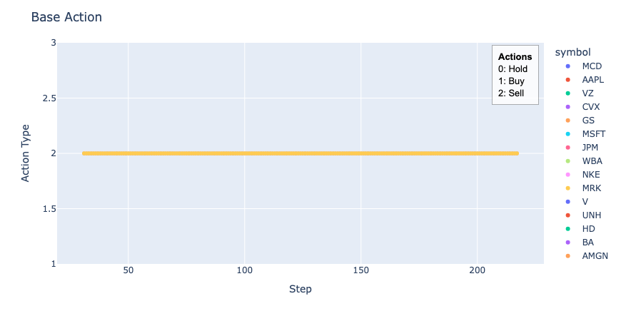
  </div>

  <!-- Sequential Buy/Sell Env -->
  <div class="relative rounded-2xl p-3 shadow-lg border border-[#2B90B6]/30 bg-white/5 backdrop-blur-md hover:scale-[1.02] transition duration-200">
    <div class="absolute top-2 right-3 text-red-400 text-lg font-bold">×</div>
    <h2 class="text-base font-semibold mb-2 bg-gradient-to-r from-[#4EC5D4] via-[#2B90B6] to-[#146b8c] bg-clip-text text-transparent whitespace-pre-line leading-snug text-center">Sequential Env</h2>
    <ul class="text-sm leading-relaxed text-white/80">
      <li> Stocks are ordered every step e.g. 1,2,...n </li>
      <li> Each stocks have their own actions</li>
      <li> Rewards 0 for multiple runs</li>
    </ul>
    <!-- Plot Image 2 -->
    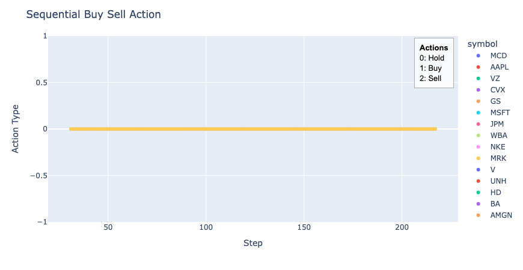
  </div>

  <!-- Scale Buy/Sell Env -->
  <div class="relative rounded-2xl p-3 shadow-lg border border-[#2B90B6]/30 bg-white/5 backdrop-blur-md hover:scale-[1.02] transition duration-200">
    <div class="absolute top-2 right-3 text-green-400 text-lg font-bold">✓</div>
    <h2 class="text-base font-semibold mb-2 bg-gradient-to-r from-[#4EC5D4] via-[#2B90B6] to-[#146b8c] bg-clip-text text-transparent whitespace-pre-line leading-snug text-center">Scaled H Env</h2>
    <ul class="text-sm leading-relaxed text-white/80">
      <li> Ensures all stocks have equal opportunity to be bought</li>
      <li> Best H scaling factor is selected </li>
      <li> Rewards vary between 4% < r < 19% </li>
    </ul>
      <!-- Plot Image 3 -->
    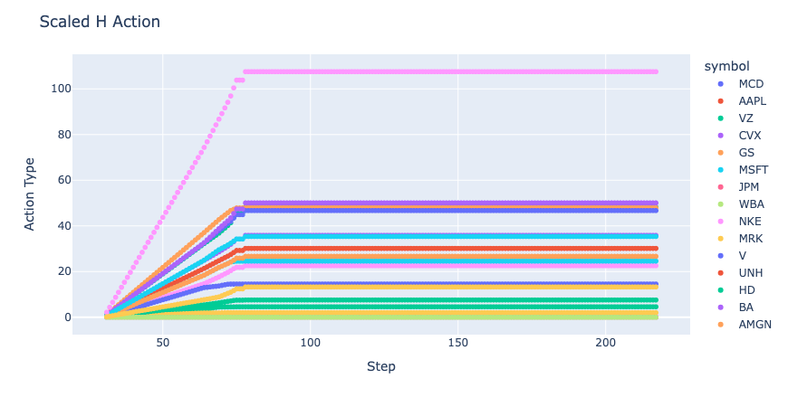
  </div>

</div>


<style>
h1 {
  background-color: #2B90B6;
  background-image: linear-gradient(45deg, #4EC5D4 10%, #146b8c 20%);
  background-size: 100%;
  -webkit-background-clip: text;
  -moz-background-clip: text;
  -webkit-text-fill-color: transparent;
  -moz-text-fill-color: transparent;
}
</style>

---
layout: center
transition: fade-in
---

# Multi Stock Results Analysis
Daily frequency with auxiliary data

<div class="px-10 mt-6">
  <div v-motion :initial="{ y: 50, opacity: 0 }" :enter="{ y: 0, opacity: 1, transition: { duration: 500 } }">
    <div class="grid grid-cols-2 gap-6">
      
      
      
      
    </div>
  </div>
</div>

<style>
h1 {
  background-color: #2B90B6;
  background-image: linear-gradient(45deg, #4EC5D4 10%, #146b8c 20%);
  background-size: 100%;
  -webkit-background-clip: text;
  -moz-background-clip: text;
  -webkit-text-fill-color: transparent;
  -moz-text-fill-color: transparent;
}
</style>

---
transition: slide-down
---

# Thank You

<div class="mt-8">
  <a 
    href="https://github.com/whanyu1212/QuantRL" 
    target="_blank" 
    class="inline-flex items-center px-6 py-3 rounded-lg bg-blue-600 text-white font-semibold shadow-md hover:bg-blue-700 transition-colors duration-300"
  >
    <carbon:logo-github class="mr-2" />
    View Project Repository
  </a>
</div>

<div class="mt-6 text-gray-500 text-sm">
  Questions? Feel free to reach out!
</div>
